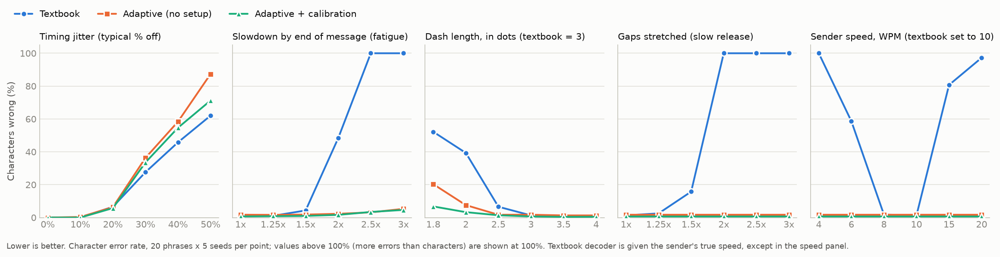

# Morse AAC Decoder

Typing with a single switch, for people who can make one reliable movement
(a press, a sip or puff, a blink) but can't keep textbook Morse timing. The
decoder learns each person's own rhythm and follows it as they speed up, slow
down, or tire, instead of expecting them to match a fixed standard.



## Why this exists

People with high spinal cord injuries, severe cerebral palsy and other
conditions that limit movement often type with one or two switches. Morse code
is one of the fastest switch methods on record: a review of the published data
found Morse users typing at 3.4 to 12.4 words per minute, against an average of
1.7 across 80 cases of switch scanning, the more common method. The Morse data
covers only two people, so it's thin, but it points the same way
([AT-node review, Koester Performance Research](https://kpronline.com/blog/morse-code-for-access-what-do-we-know/)).

The catch is timing. Standard decoders assume a dash is exactly 3 dots long and
gaps are exactly 1, 3 and 7 units. A patent for a switch-operated Morse device
describes the problem directly: for some users "it is virtually impossible to
release the switch for the proper length of time"
([US 4,706,067](https://image-ppubs.uspto.gov/dirsearch-public/print/downloadPdf/4706067)).
Dedicated Morse input devices exist, but they work at a speed the user or a
helper sets by hand, and the person has to keep to it. This project turns that
around: the decoder adapts to the person.

## What it does

- **Types from one switch.** A large on-screen button, the space bar, or any
  accessibility switch that acts as a mouse click or key press. No special
  computer permissions needed.
- **Learns your timing** from one calibration word (PARIS), or from scratch as
  you type, and keeps adjusting while you use it. Your timing is saved between
  sessions.
- **Waits for you.** A letter is finished when you stop for one second, and
  by nothing shorter, so there is time to work out the next press. The
  **Letter pause** button changes that to 0.7 or 1.5 seconds, or hands the
  decision to the learned timing, which is quicker and suits someone who knows
  the code by heart. (Gboard's Morse keyboard has the same kind of setting, a
  "character timeout":
  [Google](https://support.google.com/gboard/answer/9011881).) A space always
  takes at least 2.5 letter pauses, so there is time to start the next letter
  of a word after the last one shows.
- **Shows how sure it is.** Each letter is shown in black (sure), brown (fairly
  sure) or red (a guess), so misreads are easy to spot.
- **Fixes likely misreads.** If a letter comes out as an invalid pattern, it
  tries the single correction it was least sure about.
- **Three ways to type a space**, chosen with the Spaces button:
  - *2.5 second pause* (the default): stop pressing for 2.5 seconds and a
    space appears. Nothing extra to learn. The cost is that stopping to think
    for longer than that in the middle of a word adds a space too.
  - *Hold only*: a space is one long hold (keep the switch down until the
    button says SPACE), or the code `..--`. A pause of any length never adds
    a space, so someone can take as long as they need between letters.
  - *Learned pause*: radio-style, a pause that's long for this sender (and,
    with a letter pause set, at least 2.5 times it).

  In the first two, `----` deletes the last letter. `..--` and `----` are the
  codes Google's Gboard Morse keyboard uses, which was designed with long-time
  Morse user Tania Finlayson
  ([Google](https://blog.google/products-and-platforms/products/search/making-morse-code-available-more-people-gboard/),
  [code list](https://gist.github.com/natevw/0fce6b56c606632f8ee780b5d493f94e)).
- **Delete** also works with 8 dots (the standard Morse error signal) or a button.
- **Speaks** the text aloud with the computer's built-in voices (Windows and
  macOS). The **Voice** button steps through the installed English voices,
  saying a short sample in each, and remembers the choice. A person choosing
  how they sound matters; so does the practical side, since some voices say
  short words better than others.
- **Hears Morse too.** The **Listen** button decodes Morse beeps picked up by
  the microphone into the same text, so two people can talk in Morse, or you
  can read a signal from a radio or a phone. It finds the pitch of the beeps
  by itself and ignores talking, typing and background noise. A strong echo
  is its weak spot. Recordings can be decoded as well.
- **Hears taps on a desk.** Set the **Hears** button to taps and Listen
  decodes knocking instead: one tap for a dot, two quick taps for a dash.
  Talking doesn't disturb it; other sharp sounds do.

## Results

The benchmark sends 20 everyday phrases ("I NEED WATER", "PLEASE CALL MY
NURSE", ...) through simulated senders with one kind of imperfection turned up
at a time, and measures the character error rate (the share of letters that
come out wrong). Five random seeds per condition, 100 decodes per data point.

| Situation | Textbook decoder | Adaptive + calibration |
| --- | --- | --- |
| Ideal sender | 1.3% | 0.7% |
| Slows to half speed by the end of a message (fatigue) | 48.4% | 1.6% |
| Dashes only 2x a dot, not 3x | 39.3% | 3.3% |
| Slow to release the switch (all gaps 2x longer) | over 100%* | 0.7% |
| Sends at 6 WPM with the decoder set to 10 WPM | 58.7% | 0.7% |
| Random timing wobble of about 30% on every press | **27.6%** | 33.5% |

\* More errors than letters: the output is unreadable.

Full numbers are in [results/summary.md](results/summary.md) and
[results/benchmark.csv](results/benchmark.csv). Note the textbook decoder is
given the sender's exact speed in every row except the speed row, which is
generous: a real device only knows its setting.

**Where it loses.** When the only problem is large *random* wobble, with no
pattern to learn, a decoder that already knows the exact right timing and never
changes it does better. Adapting to noise costs some accuracy. The adaptive
decoder uses a Kalman filter that measures the person's noise level and slows
its learning down accordingly, which narrowed this gap considerably, but it
doesn't close it. The last row of the table is the honest cost of adaptivity.

**Other findings:**
- Without calibration, the decoder works out timing from the first 6 presses.
  It does nearly as well as calibrated on most conditions, but noticeably worse
  on unusual dash lengths (20.3% vs 6.8% at 1.8x), because 6 presses aren't
  enough to separate "short dashes" from "long dots".
- The adaptive decoder's accuracy is identical at every speed and every gap
  stretch, because it works entirely in ratios (log scale).
- Repairing invalid letters helps only slightly (usually under 1 percentage
  point), less than expected.
- **The space code can split in two.** Testing it myself, I kept hesitating
  where `..--` switches from taps to holds, and got the letters I and M instead
  of a space. The decoder now treats an I then an M across an unusually short
  letter gap as a split space code. In simulation, with a hesitation twice a
  normal gap, that took correct spaces from 22 to 178 out of 200 (10% timing
  wobble), and from 52 to 129 (20% wobble). The cost: real words with I then M
  (HIM, TIME) wrongly got a space 12 times in 1,000 at 10% wobble, and 117 in
  1,000 at 20%. Spaces are about 100 times more common than an I followed by an
  M, so it's a net gain, but not a free one. A long hesitation can't be fixed
  by timing at all: `..`, a long pause, then `--` *is* how you type "IM".
- **So the main way to type a space became one long hold.** On my own second
  try the rescue above still wasn't enough: I had calibrated with quick taps,
  so my hesitation was far longer than my letter gap. A single long press
  can't be split. In simulation it gave no false spaces up to 20% timing
  wobble, and overall error rates close to the `..--` code (2.0% vs 1.1% at 10
  WPM and 20% wobble). The simulated sender can't see the on-screen "SPACE"
  prompt that tells a real user when to let go, so real use should do better
  than that, but that's untested.
- **For a beginner, a fixed pause beats a learned one.** A learned word gap
  assumes steady rhythm, and a beginner recalling each code leaves long,
  uneven gaps between letters. Simulating someone who calibrated evenly and
  then typed with letter gaps around 0.9 seconds, the learned pause put
  about 8 spaces in the wrong place per 37-character message; the fixed 2.5
  second pause, 0.1. The fixed pause has its own limit: with letter gaps
  around 2.2 seconds it was wrong about 6 times per message, which is what
  the hold-only mode is for.

### The first real typing broke it

Everything above measures senders who have a rhythm, however rough. The first
time I used the app to actually type, rather than to test it, I had none. I
had calibrated with quick, careful taps (about 20 words per minute), and then
typed slowly, working out each press. The decoder had learned that my letters
were a fifth of a second apart, so it finished every letter before I could
make the second press. Nearly everything came out as E's and T's.

A timing model can't fix that by learning harder. Gaps that come from thinking
have no rhythm to learn, and the mistake feeds itself: every gap longer than
the threshold is read as a letter break, so the model never sees a long gap
*inside* a letter and never raises the threshold.

Two changes came out of it, measured with a simulated learner who watches the
screen and waits for each letter to appear before going on
([`learner_report.py`](learner_report.py), full table in
[results/learner.md](results/learner.md)):

**A letter pause.** One second without a press finishes the letter; nothing
shorter does. It is a rule a person can be told and can count, which a learned
threshold is not.

| The decoder starts from | Letters wrong, learned timing | Letters wrong, 1 s letter pause |
| --- | --- | --- |
| A calibration typed the way they really type | 13% | 2% |
| A calibration tapped out quickly (my case) | over 100%* | 18% |
| Nothing (learns as it goes) | over 100%* | 5% |

The pause costs speed: a second per letter and 2.5 per space is a ceiling of
about 9 words a minute before any time spent pressing. That is why it is a
setting and not the only way.

Back in the real app, with the saved calibration thrown away and the pause
on, the same slow typing that had produced E's and T's gave the short words I
typed. A couple of words is not a measurement, but the failure is gone.

**A second opinion.** The 18% in the middle row is the dots and dashes, not
the gaps: a decoder calibrated at twice my real speed reads my dots as dashes
until it has caught up, about 15 presses. At four times off it could stay
wrong for good, reading a slow person's dots as dashes and their dashes as
long holds, which type spaces. So the decoder now also looks at the last 12
press lengths with no model at all. If they fall into two clearly separate
groups and the model disagrees about a third or more of them, the model is
restarted from the groups.

| Person, and the calibration they started from | Without | With |
| --- | --- | --- |
| Slow presses (250 ms dots), calibrated at 60 ms | 78% | 48% |
| Quick presses (80 ms dots), calibrated at 240 ms | 45% | 28% |
| A learner (130 ms dots), calibrated at 60 ms | 18% | 18% |
| Any of the three, calibrated about right | 3 to 5% | 3 to 5% |

It needs at least three dots and three dashes before it will speak, so the
first word or two are still lost, and when the model is only twice off (third
row) ordinary learning gets there just as fast. The table is the first
sentence after a bad calibration, the worst moment; the corrected timing
carries on from there and is saved.

It can also be fooled. A run of one kind of press sometimes scatters into two
groups by chance, and a model that was fine gets restarted. In a check of 160
simulated messages from a well-calibrated learner that happened twice, and one
of the two came out worse for it. On the senders in the benchmark above it
moved results by at most half a percentage point either way.

### Sound decoding in a room

The first time the microphone decoder met a real room, it printed a stream of
E's and T's: it was decoding the background noise. Every test until then had
used clean beeps with steady hiss added, which is the one kind of noise that
is easy. The detector only measured loudness at the beep's pitch, so any noise
that swelled looked like a beep.

It now measures how far the beep's pitch *stands out* from the pitches around
it. A tone is a needle at one frequency; voices, clicks and rumble are spread
across many. A beep starts when the sound is tonal and rising, and ends when
it falls below its own peak, which keeps the echo after a beep from counting
as more beep.

Measured in a simulated room ([`morse_aac/room.py`](morse_aac/room.py); full
table in [results/room.md](results/room.md)), 10 WPM sender with 15% timing
wobble, no calibration:

| Situation | Letters wrong |
| --- | --- |
| No audio at all (the sender's timing itself) | 1.4% |
| Quiet room | 1.1% |
| Fan and quiet talking | 1.3% |
| Talking louder than the beeps | 1.8% |
| Faint beeps with some echo | 24.0% |
| Echoey room | 34.1% |
| 10 minutes of loud noise, no beeps | 0 letters decoded (the old detector: about 110 a minute) |

So noise is handled about as well as it can be, and echo is not: with a
strong echo, one beep is still dying away when the next begins, and at this
speed the gaps blur together. Keep the sound source within about a metre.

The simulated room was built after the real failure, to reproduce it. It is
still a simulation; the detector's settings were tuned on it (with different
random seeds from the ones reported).

Back on the real microphone (a laptop hearing its own speakers in a quiet
room), the fixed detector found the pitch by itself and decoded "I NEED
WATER" correctly, then added one stray letter a few seconds later, which the
simulated room had not predicted. The detector now also ignores tone-like
sounds far quieter than the beeps it has just been hearing. That is one real
trial, in one room.

It listens for a steady tone between 300 and 1200 Hz, where Morse practice
tones are. I tried letting it search up to 2500 Hz: higher beeps decoded
fine, but in ten simulated minutes of talking with no beeps at all it locked
onto a voice's overtones and typed 60 to 130 letters, where the narrow range
types 3 or 4. The narrow range stayed.

### Taps on a desk

The tone detector ignores a knock on purpose: a knock is energy at every
pitch, which is exactly what it was built to reject. And Morse can't be
knocked as it stands. What makes a beep a dot or a dash is its length, and a
knock has none (the same point is made in
["The Tap code"](https://arxiv.org/abs/1304.5069), about the separate code
that exists for tapping). So tap listening needs a
rule of its own: **one tap is a dot, two quick taps (within 0.3 seconds) are
a dash.** Letters and spaces end by pauses, as in typing.

A knock is taken to be a sound that jumps 15 dB above the background and has
fallen 12 dB again within a tenth of a second. The second half is what
separates it from a voice, which also starts suddenly but then carries on.

In the same simulated room, with made-up knocks
([results/room.md](results/room.md)):

| Situation | Letters wrong |
| --- | --- |
| No audio (the taps' timing itself) | 0.3% |
| Quiet room | 0.5% |
| Loud talking, nothing else | 1.6% |
| Typing nearby, much quieter than the taps | 5.1% |
| Other sharp sounds half as loud as the taps | 87.8% |
| 10 minutes of loud talking, no taps | 0 taps heard |

The last-but-one row is the limit, and it isn't one a better detector removes:
a pen put down on the desk *is* a knock. Tap listening is for a quiet desk.
The knocks in those tests are a click plus a low thud that I made up, not a
recording.

On its first real trial (a laptop's own microphone, tapping on the desk beside
it) it counted every tap and read the letter A, then the word SOS, correctly.
That is one desk, one person and four letters.

## How it works

Every press and gap is one of five kinds: dot, dash, gap inside a letter, gap
between letters, gap between words. The decoder models the typical length of
each as

```
typical length = unit (current speed) x textbook units (1, 3, 1, 3, 7) x personal stretch
```

- **Reading a press** uses Bayes' rule: how likely is a press this long to be a
  dot versus a dash, given how spread out this person's timing is and how
  common each is? The probability is also the confidence shown on screen.
- **Learning** uses a Kalman filter. Speed can change quickly; personal
  stretches (short dashes, slow release) change slowly. The filter measures
  how noisy the person is and learns less from noisy input, so one wild press
  can't throw the model off.
- **A second opinion** on dot and dash length comes from the last 12 presses
  alone, split into two groups with no model. It overrules the model only
  when the groups are unmistakable and the model contradicts them, which is
  what rescues a decoder that was calibrated wrongly.
- **Learning from uncertain presses** is weighted by probability (online
  expectation-maximisation). Learning only from the best guess biases the model:
  long dots misread as dashes never count toward the dot estimate, so it creeps
  shorter over time.
- **Calibration** estimates speed from all 14 presses of PARIS, the gap stretch
  from all 13 gaps, and per-kind differences with shrinkage toward the textbook,
  since 4 to 9 samples per kind are too few to trust fully.

The code explains each step in more detail: start with
[`morse_aac/adaptive.py`](morse_aac/adaptive.py).

## Setup

You need Python 3.10 or newer.

**Windows** (PowerShell):

```powershell
cd morse-aac-decoder
py -m venv venv
.\venv\Scripts\Activate.ps1
pip install -r requirements.txt
```

If activation fails with "running scripts is disabled", run
`Set-ExecutionPolicy -ExecutionPolicy RemoteSigned -Scope CurrentUser` once, then
activate again.

**macOS** (Terminal):

```bash
cd morse-aac-decoder
python3 -m venv venv
source venv/bin/activate
pip install -r requirements.txt
```

## Running it

| Command | What it does |
| --- | --- |
| `python app.py` | The typing app |
| `python benchmark.py` | Rerun the benchmark and redraw the chart (about 15 seconds) |
| `pytest` | Run the tests |
| `python make_test_audio.py "I NEED WATER"` | Make a test recording of imperfect Morse, `test_audio.wav` |
| `python decode_file.py test_audio.wav` | Decode a recording |
| `python listen.py` | The Listen button's job, in the terminal (the computer will ask for microphone access). `python listen.py taps` listens for taps |
| `python room_report.py` | Rerun the sound-in-a-room measurements, beeps and taps (about half a minute) |
| `python learner_report.py` | Rerun the learner measurements (a few minutes) |
| `python tune.py` | Re-pick the decoder's learning settings (about 2 minutes) |

In the app: click **Calibrate** and send PARIS the way you will really type,
no faster. Then type: stop for 1 second to finish a letter and 2.5 seconds to
get a space; send `----` to delete the last letter. If letters come out wrong
after a calibration, **Forget my timing** starts the decoder from scratch.

## Project layout

```
morse_aac/
  table.py          Morse alphabet
  events.py         the shared input format: (on/off, duration) pairs
  decoder_base.py   letters, words, delete, repair: shared by both decoders
  naive.py          textbook decoder (the baseline)
  adaptive.py       the adaptive decoder
  calibration.py    learning timing from one PARIS
  session.py        live decoding with timeouts, driven by a clock
  controller.py     the app's logic, without any window code
  profile.py        saving timing and settings between sessions
  speech.py         speaking text with the computer's built-in voices
  audio.py          tone detection (Goertzel filters) for recordings and microphones
  listener.py       waits for beeps, finds their pitch, decodes sound as it arrives
  taps.py           knock detection, and taps to letters (one tap dot, two taps dash)
  microphone.py     the microphone, with plain messages when it can't be opened
  room.py           a simulated noisy, echoey room, for testing the tone detector
  synth.py          simulated imperfect senders, and a learner who watches the screen
  metrics.py        character error rate
app.py              the window
benchmark.py        naive vs. adaptive comparison
tune.py             picks the learning settings
room_report.py      sound decoding in the simulated room
learner_report.py   typing by someone still learning the code
tests/              139 tests
```

## Honest scope

- **All results are from simulated senders.** No one with a motor impairment
  has tested this yet. The simulation covers speed, fatigue, dash length, slow
  release, random wobble and a learner's thinking pauses, but real people will
  have patterns it doesn't include, such as tremor or spasms that cause extra
  presses. The one real typist so far (me) broke it in a way no simulation
  had, which is the best argument for the next step below.
- **Tap listening has had one real trial**: four letters, on one desk.
  Everything else about it is measured on made-up knocks, and its double-tap
  window is fixed at 0.3 seconds, not learned.
- **Settings were tuned on different random seeds (100-102)** from the ones the
  benchmark reports (0-4), so the numbers aren't fitted to the test data. They
  were still tuned on the same kind of simulated sender, though.
- **Very short messages without calibration are fragile.** With no saved timing,
  the decoder learns from the first few letters. A 3-letter message gives it one
  or two gaps between letters to go on, and if those happen to be short, a
  normal gap later can look like a word break. Decoding "SOS" from audio with no
  setup gave "SO S" or "S OS" in 15 of 120 trials. Calibrating first avoids this,
  which is why the app asks for it.
- **This is not a medical device** and shouldn't replace someone's existing
  communication system.

## Next steps toward real use

1. Test with real switch users, through an assistive technology clinic or
   specialist, measuring words per minute and error rate against their current
   method. The benchmark harness can take real recorded timing in place of
   simulated timing.
2. Model more real imperfections: accidental double presses and tremor.
3. Word prediction, which multiplies effective speed for slow input.
4. Test the sound decoder in more real rooms and against real radio
   recordings, and make it cope with echo (for example by estimating the
   room's echo and subtracting it).

## License

MIT. See [LICENSE](LICENSE).
